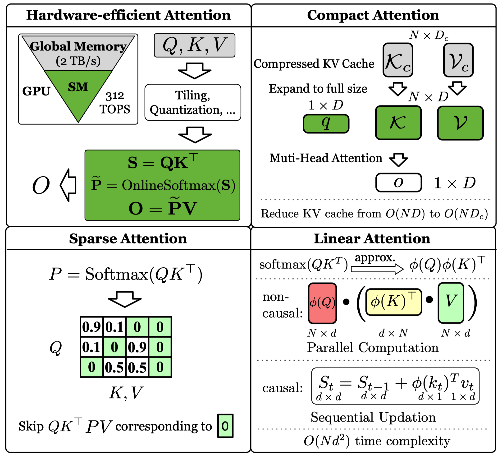

# attention_survey.github.io

**A Survey of Efficient Attention Methods: Hardware-efficient, Sparse, Compact, and Linear Attention**  

Paper webpage: https://attention-survey.github.io  
Github: https://github.com/attention-survey/Efficient_Attention_Survey  
**PDF**: https://attention-survey.github.io/files/Attention_Survey.pdf  




## Citation

If you find our work helpful, please cite our paper:

```
@article{zhang2025efficient,
  title={A Survey of Efficient Attention Methods: Hardware-efficient, Sparse, Compact, and Linear Attention},
  author={Zhang, Jintao and Su, Rundong and Liu, Chunyu and Wei, Jia and Wang, Ziteng and Zhang, Pengle and Wang, Haoxu and Jiang, Huiqiang and Huang, Haofeng and Xiang, Chendong and Xi, Haocheng and Yang, Shuo and Li, Xingyang and Hu, Yuezhou and Fu, Tianyu and Zhao, Tianchen and Zhang, Yicheng and Cao, Boqun and Jiang, Youhe and Chen, Chang and Jiang, Kai and Chen, Huayu and Zhao, Min and Xu, Xiaoming and Wu, Yi and Bao, Fan and Zhu, Jun and Chen, Jianfei},
  year={2025}
}
```
